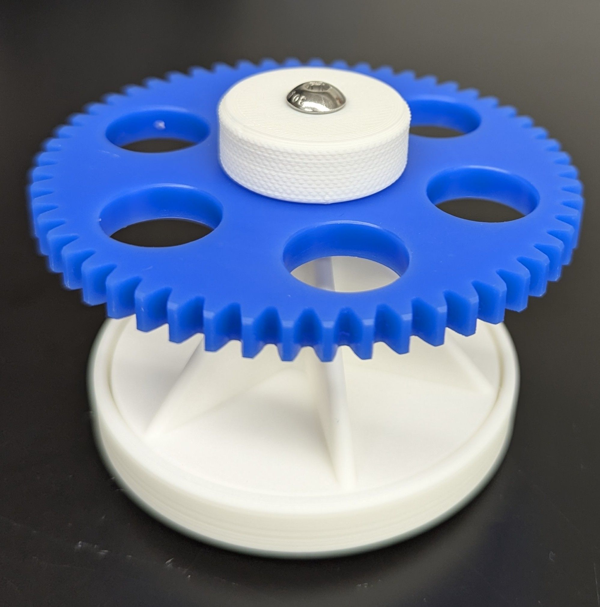

# Bioruptor-Compatible 12 x 0.5 mL Holder

3D printable alternative to the [Bioruptor item](https://www.diagenode.com/en/p/0-5-0-65-ml-tube-holder-for-bioruptor-standard-plus-pico-1-pack#). 

Ideally, reuse an existing Bioruptor holder gear (blue, POM material, pictured below). A printable version is included - but should be printed from nylon or similarly slippery material.

 

## BOM (Bill of Materials)

Some hardare is required:

| Quantity | Part | Material | Source |
| -:| - | - | - |
| 2x | M5-16mm Button Head Cap Screw | Stainless Steel | [Amazon (US)](https://www.amazon.com/dp/B07NVC2ZTP)
| 4x | M5-5.8mm Heat Set Insert | Brass | [Amazon (US)](https://www.amazon.com/dp/B09MTRT9T7)
| | Thread Locking Compound* | Red or Blue | [Amazon (US)](https://www.amazon.com/dp/B000I1RSNS)

*optional but highly recommended.

## Assembly

1. Melt the threaded inserts into the printed parts:
    - TODO instructional image
2. Apply thread locker to the screws prior to inserting into the thumb screw and holder threads.
3. Allow to cure overnight before use.