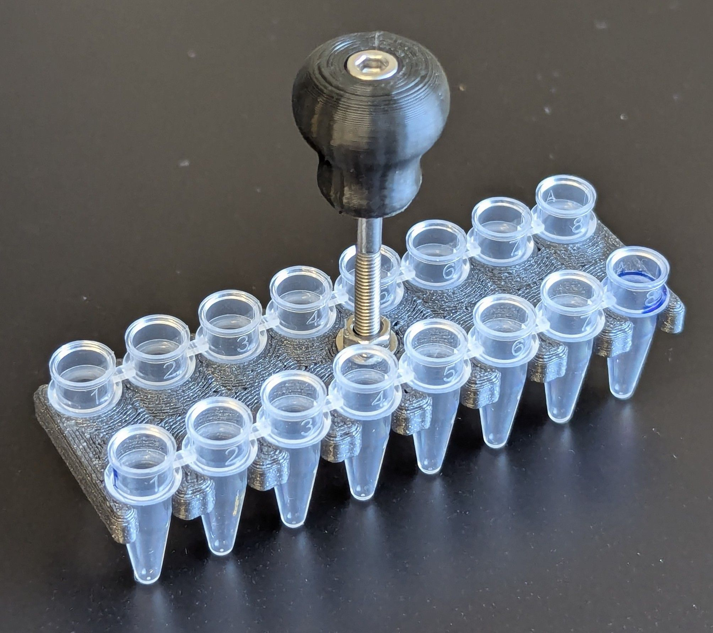

# PCR Strip Sonication Bath Holder

2x 8-tube strips holder for bath sonication. Keeps your fingers out of the
sonicator, allows you to move the tubes around.

## BOM (Bill of Material)

| Quantity | Part | Material | Source |
| -:| - | - | - |
| 1x | M3-30mm Socket Head Cap Screw | Stainless Steel | [Amazon (US)]()
| 1x | M3-5x4 Heat Set Insert | Brass | [Amazon (US)](https://www.amazon.com/dp/B0CDH36ZMX)
| 1x | M3 Hex Nut | Stainless Steel | |

## Note on Material

The knob grip was printed in Fiberlogy Fiberflex 30D TPU - a rubber like material. This reduces vibrations transmitted through the steel screw.