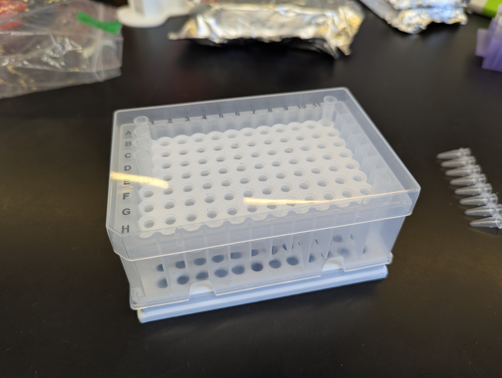

# StageTip High-Throughput Adaptor Plate

Adaptor plate allows StageTips to be centrifuged in a swinging bucket rotor:
- Allows up to 192 StageTips to be spun at once
- Multi-channel pipetting increases throughput
- Collection/waste plates can be emptied/swapped quickly

## Required materials

### Adaptor Plate

3D-printable file included here. Allows P200 StageTips to sit securely in the
`Top Rack`.

### Top Rack

When used in combination with the `Adaptor Plate`, allows StageTips to be spun above
a collection/waste plate.

[USA Scientific 1.2 mL 8-Strip Tubes, Racked](https://www.usascientific.com/1pt2-ml-tube-strip-8/p/Dil-Tube-12-8) - Catalog: 1412-8400

Tube strips are discarded, and the adaptor plate inserted snuggly in the top.

### Collection Bottom Plate/Rack

Tested with the following:

- [NEST 12-Well Reservoir, 15 mL](https://opentrons.com/products/nest-12-well-reservoirs-15-ml) Catalog: 999-00076
    - Good waste plate.
    - 12-well design compartmentalizes the flowthrough, keeps it from spilling or touching the tips.
- [3D printed PCR strip rack](../PCR_strip_96_rack/)
    - Designed to stack securely.
    - Great for collecting many samples at once.