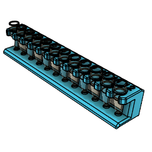
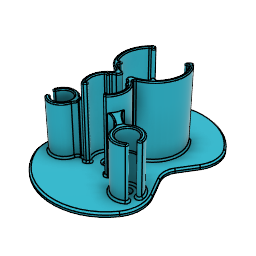
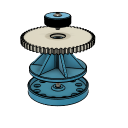
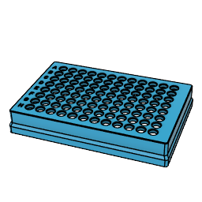
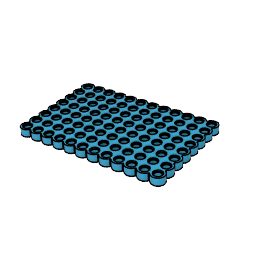
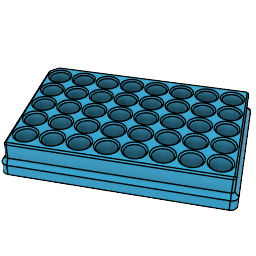
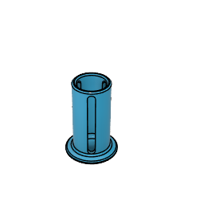
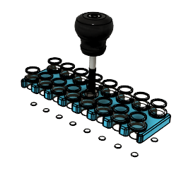

# MSK Proteomics Core Labware

A collection of 3D printable labware that I created
while for the MSK Proteomics Core facility.

## Racks, Stands, Holders

| Description | Link | Image |
| - | - | - |
| 0.2 mL PCR strip magnetic rack | [Link](Designs/Racks_Stands_Holders/PCR_strip_magnetic_rack) | |
| 50/15/1.5 mL tube combo stand | [Link](Designs/Racks_Stands_Holders/50-15-1.5mL_combo_stand/) |  |
| Bioruptor-compatible 12 x 0.5 mL tube holder | [Link](Designs/Racks_Stands_Holders/Bioruptor_12x0.5mL_holder) | 
| PCR strip rack (96x), Opentrons compatible | [Link](Designs/Racks_Stands_Holders/PCR_strip_96_rack/) | |
| StageTip high-throughput adaptor plate | [Link](Designs/Racks_Stands_Holders/StageTip_adaptor_plate/) | 
| HPLC vial rack (40x), Opentrons-compatible|  [Link](Designs/Racks_Stands_Holders/HPLC_vial_rack_40x) | 
| Weigh scale 1.5 mL tube stand | [Link](Designs/Racks_Stands_Holders/Weighscale_1.5mL_stand/) | 
| PCR strip sonication bath holder| [Link](Designs/Racks_Stands_Holders/PCR_strip_sonication_holder) | 

## Repairs

| Description | Link | Image |
| - | - | - |
| Opentrons P300M Gen2 replacement carriage | [Link](Designs/Repairs/Opentrons_P300M_Gen2_Carriage)